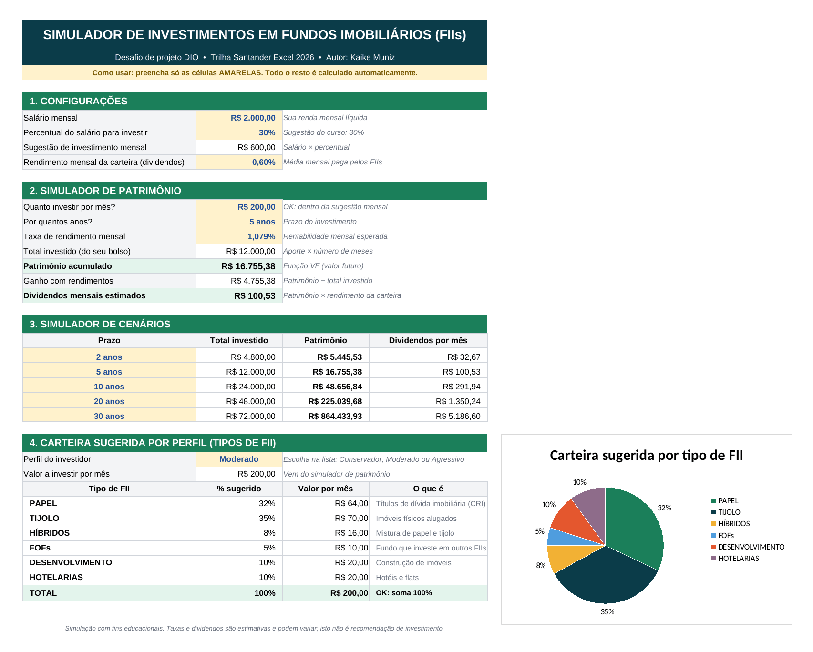
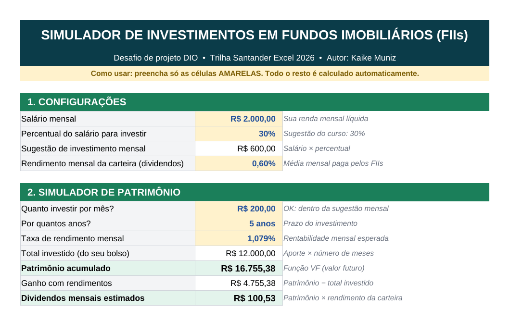
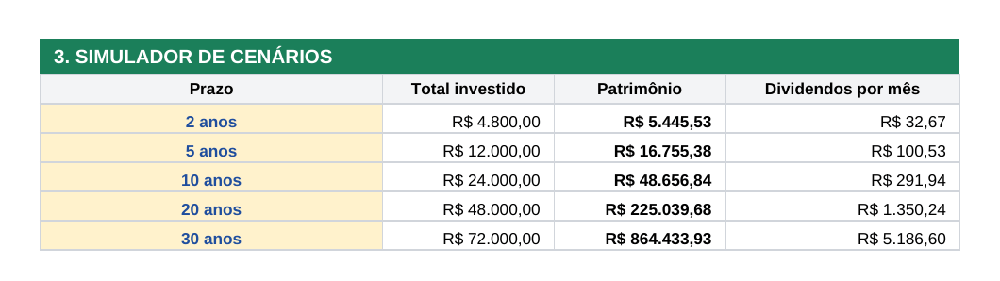
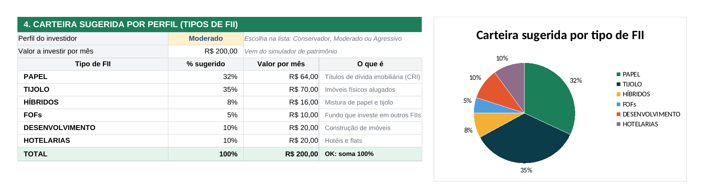
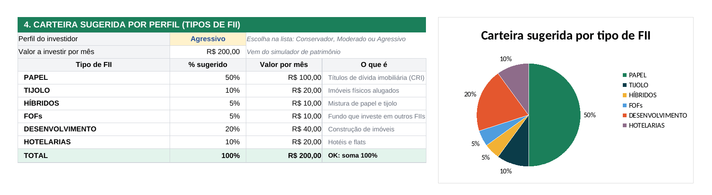
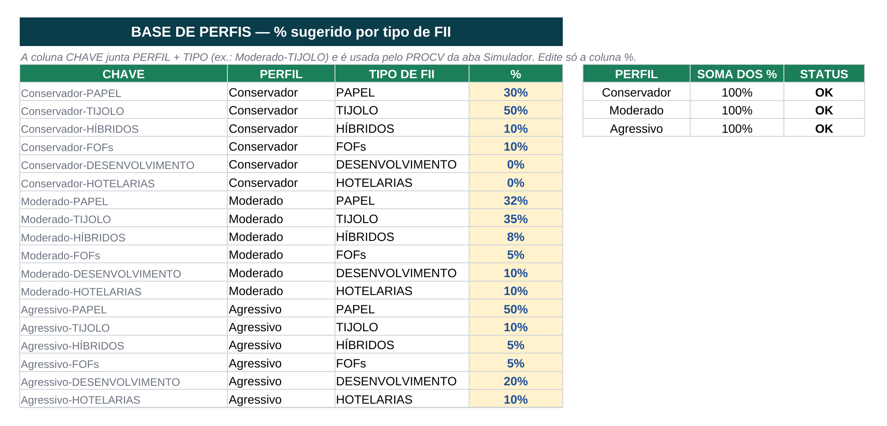

# 📊 Simulador de Investimentos em Fundos Imobiliários (FIIs) no Excel


Planilha que ajuda qualquer pessoa a **simular investimentos em Fundos Imobiliários**, respondendo de forma automática às perguntas mais comuns: *quanto investir por mês, por quanto tempo, quanto vou acumular e quanto vou receber de dividendos*.

Projeto desenvolvido para o desafio **"Criando uma Ferramenta de Controle de Investimentos com Excel"** da [DIO](https://www.dio.me/), na trilha **Bootcamp Santander Excel com IA e Claude 2026**.

📥 **[Baixar a planilha (Simulador_Investimentos_FIIs.xlsx)](./Simulador_Investimentos_FIIs.xlsx)**



---

## 📑 Sumário

- [Objetivo](#-objetivo)
- [Perguntas de negócio](#-perguntas-de-negócio)
- [Como usar](#-como-usar)
- [Estrutura da planilha](#-estrutura-da-planilha)
- [Passo a passo da construção](#-passo-a-passo-da-construção)
- [Fórmulas principais](#-fórmulas-principais)
- [Exemplo de resultado](#-exemplo-de-resultado)
- [Melhorias que eu adicionei](#-melhorias-que-eu-adicionei)
- [O que eu aprendi](#-o-que-eu-aprendi)
- [Estrutura do repositório](#-estrutura-do-repositório)
- [Autor](#-autor)

---

## 🎯 Objetivo

Construir uma ferramenta prática no Excel que **automatize os cálculos** de um investimento mensal em FIIs:

- valor total investido;
- patrimônio acumulado ao final do prazo;
- dividendos mensais que esse patrimônio pode gerar;
- comparação de cenários (2, 5, 10, 20 e 30 anos);
- divisão do aporte entre os tipos de FII, de acordo com o perfil do investidor.

---

## ❓ Perguntas de negócio

A planilha foi montada a partir das perguntas que um investidor normalmente faz:

| Pergunta | Onde está na planilha | Como é respondida |
|---|---|---|
| Quanto posso investir por mês? | 1. Configurações | Salário × percentual escolhido (sugestão: 30%) |
| Quanto vou investir por mês? | 2. Simulador de Patrimônio | Valor digitado pelo usuário |
| Por quantos anos? | 2. Simulador de Patrimônio | Valor digitado pelo usuário |
| Qual a taxa de rendimento mensal? | 2. Simulador de Patrimônio | Valor digitado pelo usuário |
| Quanto vou ter acumulado? | 2. Simulador de Patrimônio | Função **VF** (valor futuro) |
| Quanto vou receber de dividendos por mês? | 2. Simulador de Patrimônio | Patrimônio × rendimento da carteira |
| E se eu investir por mais tempo? | 3. Simulador de Cenários | Mesmo cálculo para 2, 5, 10, 20 e 30 anos |
| Como dividir o dinheiro entre os tipos de FII? | 4. Carteira por Perfil | **PROCV** na tabela de perfis |

---

## 🚀 Como usar

1. Baixe o arquivo [`Simulador_Investimentos_FIIs.xlsx`](./Simulador_Investimentos_FIIs.xlsx) e abra no Excel.
2. Preencha **somente as células amarelas**:
   - salário, percentual para investir e rendimento da carteira;
   - valor do aporte mensal, prazo em anos e taxa de rendimento mensal;
   - (opcional) os prazos da tabela de cenários.
3. Escolha o **perfil do investidor** na lista: `Conservador`, `Moderado` ou `Agressivo`.
4. Pronto: patrimônio, dividendos, cenários, carteira e gráfico se atualizam sozinhos.

> [!TIP]
> Se o arquivo abrir no **Modo de Exibição Protegido**, clique em **Habilitar Edição** para poder alterar os valores.

---

## 🧱 Estrutura da planilha

A planilha tem **duas abas**:

| Aba | Para que serve |
|---|---|
| `Simulador` | Tela principal, com as 4 seções do simulador e o gráfico |
| `Perfis` | Base de dados com o percentual sugerido de cada tipo de FII para cada perfil |

**Seções da aba `Simulador`:**

1. **Configurações** — salário, percentual para investir, sugestão de investimento e rendimento da carteira.
2. **Simulador de Patrimônio** — aporte, prazo, taxa, total investido, patrimônio, ganho e dividendos.
3. **Simulador de Cenários** — o mesmo cálculo para vários prazos, lado a lado.
4. **Carteira Sugerida por Perfil** — quanto do aporte vai para cada tipo de FII, com gráfico de pizza.

**Padrão de cores (uniformidade visual):**

| Cor | Significado |
|---|---|
| 🟨 Amarelo | Campo para o usuário preencher |
| ⬜ Branco | Resultado calculado por fórmula |
| 🟩 Verde-claro | Resultado principal (patrimônio, dividendos, totais) |
| 🟩 Verde-escuro | Título de seção |
| 🟦 Azul-petróleo | Cabeçalho da planilha |

---

## 🔧 Passo a passo da construção

Abaixo está como cada parte foi construída, seguindo a ordem das aulas.

### 1. Base da tabela

Primeiro organizei os blocos da planilha (Configurações, Investimento Mensal, Cenários e Perfil), deixando o **rótulo** na coluna B, o **valor** na coluna C e uma **dica** ao lado, explicando cada campo.

### 2. Simulador de Patrimônio (função VF)

O coração da planilha é a função **VF** (valor futuro), que calcula quanto um aporte mensal fixo vira depois de um tempo, com juros compostos:

```excel
=VF(taxa; nper; pgto)
```

| Argumento | O que significa | Na planilha |
|---|---|---|
| `taxa` | taxa de rendimento **por período** | `taxa_mensal` (1,079% ao mês) |
| `nper` | número de períodos | `qtd_anos*12` (anos convertidos em meses) |
| `pgto` | valor aplicado em cada período | `-aporte` |

> [!NOTE]
> O aporte entra **negativo** (`-aporte`) porque, para o Excel, é um dinheiro que sai do seu bolso. Assim o resultado (o patrimônio) aparece positivo.

Com o patrimônio calculado, os **dividendos mensais** são o patrimônio multiplicado pelo rendimento mensal da carteira.



### 3. Simulador de Cenários

Aqui a mesma conta é feita para vários prazos ao mesmo tempo. A fórmula foi escrita uma vez e arrastada para baixo, usando **referência mista** (`$B23`) para travar a coluna do prazo:

```excel
=VF(taxa_mensal; $B23*12; -aporte)
```



### 4. Variáveis globais e nomeação de intervalos

Em vez de usar endereços como `$D$19`, dei **nomes** às células importantes (em *Fórmulas > Gerenciador de Nomes*). Isso deixa as fórmulas mais fáceis de ler e evita erros ao copiar.

| Nome | Célula | Conteúdo |
|---|---|---|
| `salario` | `Simulador!C7` | Salário mensal |
| `perc_investimento` | `Simulador!C8` | % do salário para investir |
| `sugestao_investimento` | `Simulador!C9` | Sugestão de investimento mensal |
| `rendimento_carteira` | `Simulador!C10` | Rendimento mensal da carteira (dividendos) |
| `aporte` | `Simulador!C13` | Quanto investir por mês |
| `qtd_anos` | `Simulador!C14` | Prazo em anos |
| `taxa_mensal` | `Simulador!C15` | Taxa de rendimento mensal |
| `total_investido` | `Simulador!C16` | Total tirado do bolso |
| `patrimonio` | `Simulador!C17` | Patrimônio acumulado |
| `ganho` | `Simulador!C18` | Ganho com rendimentos |
| `dividendos_mensais` | `Simulador!C19` | Dividendos mensais estimados |
| `perfil` | `Simulador!C30` | Perfil escolhido |
| `valor_mensal` | `Simulador!C31` | Valor a distribuir na carteira |
| `tabela_perfis` | `Perfis!A4:D21` | Base de perfis usada pelo PROCV |

Comparação:

```excel
Sem nomes:  =VF($D$19;$D$18*12;$D$17*-1)
Com nomes:  =VF(taxa_mensal;qtd_anos*12;-aporte)
```

### 5. Uniformidade visual

Padronizei fonte (Arial), cores, bordas e formatos de número (moeda `R$`, porcentagem e o formato personalizado `0 "anos"`). Também escondi as linhas de grade para a planilha parecer um aplicativo.

### 6. Tipos de fundo e carteira por perfil

Cada tipo de FII tem um papel diferente na carteira:

| Tipo de FII | O que é |
|---|---|
| **Papel** | Investe em títulos de dívida do setor imobiliário, como CRI. A renda vem dos juros. |
| **Tijolo** | Tem imóveis físicos (galpões, lajes corporativas, shoppings). A renda vem dos aluguéis. |
| **Híbridos** | Mistura papel e tijolo no mesmo fundo. |
| **FOFs** | *Fund of Funds*: fundo que compra cotas de outros FIIs. |
| **Desenvolvimento** | Financia a construção de imóveis. Tem mais risco e mais potencial de retorno. |
| **Hotelarias** | Hotéis e flats. A renda depende da ocupação. |

Na aba `Perfis`, cada linha tem uma **chave** que junta perfil e tipo (`Moderado-TIJOLO`). Na aba `Simulador`, o **PROCV** monta a mesma chave e busca o percentual:

```excel
=PROCV(perfil&"-"&B33; tabela_perfis; 4; FALSO)
```

Distribuição usada:

| Tipo de FII | Conservador | Moderado | Agressivo |
|---|:---:|:---:|:---:|
| Papel | 30% | 32% | 50% |
| Tijolo | 50% | 35% | 10% |
| Híbridos | 10% | 8% | 5% |
| FOFs | 10% | 5% | 5% |
| Desenvolvimento | 0% | 10% | 20% |
| Hotelarias | 0% | 10% | 10% |
| **Total** | **100%** | **100%** | **100%** |

Ao trocar o perfil na lista, a tabela e o gráfico mudam na hora:

**Perfil Moderado**



**Perfil Agressivo**



**Aba `Perfis` (base de dados + conferência de 100%)**



---

## 🧮 Fórmulas principais

Fórmulas como aparecem no Excel em português (separador `;`):

```excel
Sugestão de investimento   =salario*perc_investimento
Total investido            =aporte*qtd_anos*12
Patrimônio acumulado       =VF(taxa_mensal;qtd_anos*12;-aporte)
Ganho com rendimentos      =patrimonio-total_investido
Dividendos mensais         =patrimonio*rendimento_carteira
Alerta do aporte           =SE(aporte>sugestao_investimento;"Atenção: acima da sugestão mensal";"OK: dentro da sugestão mensal")

Cenário - total investido  =$B23*12*aporte
Cenário - patrimônio       =VF(taxa_mensal;$B23*12;-aporte)
Cenário - dividendos       =D23*rendimento_carteira

Carteira - % sugerido      =PROCV(perfil&"-"&B33;tabela_perfis;4;FALSO)
Carteira - valor por mês   =C33*valor_mensal
Carteira - conferência     =SE(ARRED(C39;4)=1;"OK: soma 100%";"Revisar: soma diferente de 100%")

Perfis - chave             =B4&"-"&C4
Perfis - soma por perfil   =SOMASE($B$4:$B$21;F4;$D$4:$D$21)
```

<details>
<summary>Ver as mesmas fórmulas no Excel em inglês</summary>

| Português | Inglês |
|---|---|
| `VF` | `FV` |
| `PROCV` | `VLOOKUP` |
| `SE` | `IF` |
| `SOMA` | `SUM` |
| `SOMASE` | `SUMIF` |
| `ARRED` | `ROUND` |
| `FALSO` | `FALSE` |

No Excel em inglês o separador de argumentos é a vírgula (`,`).

</details>

---

## 📈 Exemplo de resultado

Com os valores de exemplo das aulas: **R$ 200,00 por mês**, taxa de **1,079% ao mês** e rendimento da carteira de **0,60% ao mês**.

| Prazo | Total investido | Patrimônio | Dividendos por mês |
|---|---:|---:|---:|
| 2 anos | R$ 4.800,00 | R$ 5.445,53 | R$ 32,67 |
| 5 anos | R$ 12.000,00 | R$ 16.755,38 | R$ 100,53 |
| 10 anos | R$ 24.000,00 | R$ 48.656,84 | R$ 291,94 |
| 20 anos | R$ 48.000,00 | R$ 225.039,68 | R$ 1.350,24 |
| 30 anos | R$ 72.000,00 | R$ 864.433,93 | R$ 5.186,60 |

Em 30 anos, os R$ 72 mil tirados do bolso viram mais de R$ 864 mil. Esse é o efeito dos **juros compostos** ao longo do tempo.

---

## ✨ Melhorias que eu adicionei

Além do que foi feito nas aulas, incluí alguns ajustes para deixar a ferramenta mais completa:

- [x] **Percentual de investimento editável**: os 30% viraram um campo, em vez de ficarem fixos na fórmula.
- [x] **Total investido e ganho com rendimentos**: mostra quanto saiu do bolso e quanto veio dos juros.
- [x] **Alerta de aporte**: avisa se o valor mensal passa da sugestão calculada pelo salário.
- [x] **Cenários com total investido**, para comparar o dinheiro aplicado com o patrimônio.
- [x] **Validação de dados**: lista suspensa para o perfil e bloqueio de valores inválidos (prazo de 1 a 50 anos, percentuais entre 0% e 100%).
- [x] **Conferência automática**: confirma que cada perfil soma 100%.
- [x] **Descrição de cada tipo de FII** ao lado da carteira.
- [x] **Gráfico de pizza** com a distribuição da carteira.
- [x] **Legenda de uso** ("preencha só as células amarelas").

---

## 🎓 O que eu aprendi

- Transformar **perguntas de negócio** em cálculos dentro de uma planilha.
- Usar a função **VF** para calcular juros compostos com aportes mensais.
- Usar **referências absolutas e mistas** (`$`) para copiar fórmulas sem erro.
- Criar **intervalos nomeados** e usá-los como variáveis globais, deixando as fórmulas legíveis.
- Montar uma **chave composta** e buscar valores com **PROCV**.
- Aplicar **validação de dados** e **formatação personalizada**.
- Manter **uniformidade visual** para a planilha ficar fácil de usar.
- Os principais **tipos de Fundos Imobiliários** e como eles se encaixam em cada perfil de investidor.
- Documentar um projeto com **Markdown** e publicar no **GitHub**.

---

## 📂 Estrutura do repositório

```text
simulador-investimentos-fii-excel/
├── README.md                              # esta documentação
├── Simulador_Investimentos_FIIs.xlsx      # a planilha
└── images/                                # capturas de tela usadas no README
    ├── 01-visao-geral.png
    ├── 02-configuracoes-e-patrimonio.png
    ├── 03-cenarios.png
    ├── 04-carteira-perfil-moderado.png
    ├── 05-carteira-perfil-agressivo.png
    └── 06-base-de-perfis.png
```

---

## ⚠️ Aviso

Este projeto tem **fins educacionais**. As taxas de rendimento e de dividendos são estimativas e podem variar. Nada aqui é recomendação de investimento.

---

## 👤 Autor

**Kaike Muniz**

[](https://github.com/KaikeMnz)
